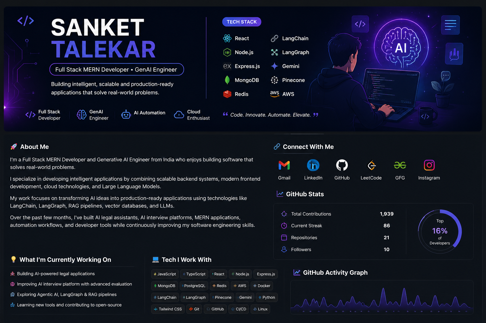

<!-- ===================================================== -->
<!--                    GitHub Profile README              -->
<!-- ===================================================== -->

<p align="center">
  
</p>

<h1 align="center">
Hi 👋, I'm Sanket Talekar
</h1>

<h3 align="center">
Full Stack MERN Developer • GenAI Engineer • AI Automation • Building Production-Ready AI Applications
</h3>

<p align="center">
  <a href="https://komarev.com/ghpvc/?username=DetectiveSanket">
    
  </a>

  <a href="https://github.com/DetectiveSanket?tab=followers">
    
  </a>

  <a href="https://github.com/DetectiveSanket">
    
  </a>
</p>

---

# 🚀 About Me

I'm a **Full Stack MERN Developer** and **Generative AI Engineer** from India who enjoys building software that solves real-world problems.

I specialize in developing intelligent applications by combining scalable backend systems, modern frontend development, cloud technologies, and Large Language Models.

My work focuses on transforming AI ideas into production-ready applications using technologies like **LangChain**, **LangGraph**, **RAG pipelines**, **vector databases**, and **LLMs**.

Over the past few months, I've built AI legal assistants, AI interview platforms, MERN applications, automation workflows, and developer tools while continuously improving my software engineering skills.

I enjoy designing clean architectures, writing maintainable code, and learning new technologies that help build better products.

---

# 💡 What I'm Currently Working On

- ⚖️ Building AI-powered legal applications
- 🤖 Developing intelligent AI Agents using LangGraph
- 🧠 Exploring Multi-Agent Systems
- 📚 Improving Data Structures & Algorithms
- ☁️ Learning scalable backend architecture
- 🚀 Building production-ready Full Stack applications
- 🔍 Looking for Full Stack Developer & AI Engineer opportunities

---

# 🛠️ Tech Stack

## 👨‍💻 Languages

<p>

</p>

---

## 🎨 Frontend

<p>

</p>

---

## ⚙️ Backend

<p>

</p>

---

## 🗄️ Databases

<p>


</p>

---

## 🤖 AI / GenAI


<p>


</p>


### Experience With

- LangChain
- LangGraph
- RAG Pipelines
- Prompt Engineering
- Context Engineering
- AI Agents
- Vector Embeddings
- Pinecone
- Google Gemini
- OpenAI APIs
- AI Workflow Automation
- LLM Application Development

---

## ☁️ DevOps & Cloud

<p>


</p>

---

# 🌟 Connect With Me

<p align="left">

<a href="mailto:sankettalekar896@gmail.com">

</a>

<a href="https://www.linkedin.com/in/sanket-talekar-94087a263">

</a>

<a href="https://www.instagram.com/sanket_talekar1717/">

</a>

<a href="https://leetcode.com/u/sankettalekar896/">

</a>

<a href="https://www.geeksforgeeks.org/user/sankettalhufl/">

</a>

</p>

---

# 🚀 Featured Projects

<table>
<tr>

<td width="50%">

## ⚖️ NyayaSathi — AI Constitution

> AI-powered legal assistant using RAG, LangChain, Gemini, Redis and Pinecone.

**Tech:** React • Node.js • MongoDB • Redis • LangChain • Pinecone

🔗 **Repository:** https://github.com/DetectiveSanket/NyayaSathi---AI-constitution

🌐 **Live Demo:** https://nyaya-sathi-ai-constitution.vercel.app/
</td>

</tr>
</table>

---

<table>
<tr>

<td width="50%">

## 🤖 AI Interview Application

> AI-powered interview preparation platform that simulates technical interviews, evaluates candidate performance, and provides intelligent feedback using Large Language Models.

**✨ Key Features**
- 🎙️ AI-powered mock interviews
- 🧠 Intelligent interview evaluation
- 📊 Performance analytics & feedback
- 💬 Voice & text-based interview support
- 🤖 LLM-powered question generation
- 📈 Detailed interview reports

**🛠️ Tech Stack:** React • Node.js • Express • MongoDB • PostgreSQL • Redux • LangChain • LangGraph • Gemini API • Hugging Face

🔗 **Repository:** https://github.com/DetectiveSanket/AI-Interview-Application

🌐 **Live Demo:** https://app-interview-ai-aa743779.base44.app/

</td>

</tr>
</table>

---

<table>
<tr>

<td width="50%">

## 🏥 Healthcare Diagnostic Platform

A healthcare platform for diagnostic test booking, authentication, reports and AI-powered assistance.

### Features

- 🔐 Authentication
- 📅 Appointment Booking
- 🤖 AI Chatbot
- 📂 Report Management
- 💳 Payment Integration

### Tech

`React`

`Express`

`MongoDB`

`Firebase`

`Redis`

</td>

<td width="50%">

⭐ Internship Project

</td>

</tr>
</table>

---

# 🏆 GitHub Achievements

<p align="center">


</p>

---

# 📊 GitHub Statistics

<div align="center">


</div>

---

# 📈 Contribution Activity

<p align="center">


</p>

---

# 🐍 Contribution Snake

<p align="center">


</p>

---

# 📈 GitHub Summary

<p align="center">


</p>

---

---

# ⌨️ Coding Activity

### 📊 Coding Time (Last Month)

<!--START_SECTION:waka-->

```txt
JavaScript      53 hrs 51 mins  🟩🟩🟩🟩🟩🟩🟩🟩🟩🟩🟩⬜⬜⬜⬜⬜⬜⬜⬜⬜⬜⬜⬜⬜   40.19 %
Cpp             51 hrs 47 mins  🟩🟩🟩🟩🟩🟩🟩🟩🟩🟩⬜⬜⬜⬜⬜⬜⬜⬜⬜⬜⬜⬜⬜⬜   38.21 %
Other           10 hrs 08 mins  🟩🟩🟨⬜⬜⬜⬜⬜⬜⬜⬜⬜⬜⬜⬜⬜⬜⬜⬜⬜⬜⬜⬜⬜   09.63 %
Markdown        04 hrs 56 mins  🟩⬜⬜⬜⬜⬜⬜⬜⬜⬜⬜⬜⬜⬜⬜⬜⬜⬜⬜⬜⬜⬜⬜⬜   04.68 %
Text            02 hrs 57 mins  🟨⬜⬜⬜⬜⬜⬜⬜⬜⬜⬜⬜⬜⬜⬜⬜⬜⬜⬜⬜⬜⬜⬜⬜   02.80 %
```

<!--END_SECTION:waka-->

---

# 📈 GitHub Contribution Graph

<p align="center">

</p>

---

</p>

---

# 💼 Open To

- 🤖 AI Engineer
- 💻 Full Stack Developer
- ⚙️ Backend Developer
- ☁️ Cloud & AI Automation
- 🚀 Open Source Collaboration

---

# 💬 Quote I Believe In

> *"Great software isn't built by knowing every technology—it's built by solving real problems."*

---

# 🤝 Let's Connect

<p align="center">

<a href="mailto:sankettalekar896@gmail.com">

</a>

<a href="https://www.linkedin.com/in/sanket-talekar-94087a263">

</a>

<a href="https://leetcode.com/u/sankettalekar896/">

</a>

<a href="https://www.geeksforgeeks.org/user/sankettalhufl/">

</a>

<a href="https://www.instagram.com/sanket_talekar1717/">

</a>

</p>

---

<div align="center">

### ⭐ If you like my work, consider giving a star to my repositories.

### Thanks for visiting my profile! 👋

*"Always building. Always learning. Always improving."*

</div>
